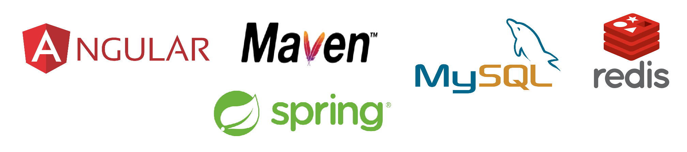
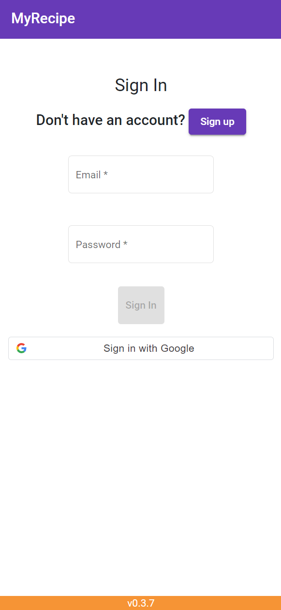
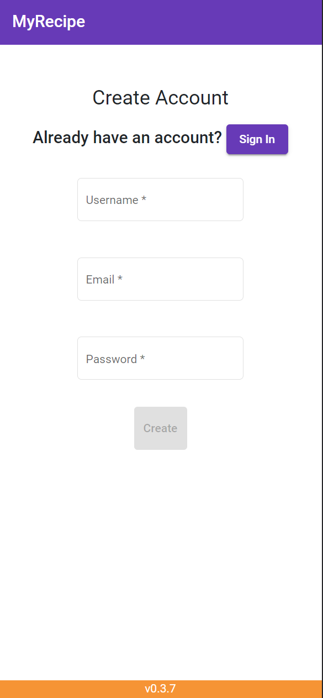
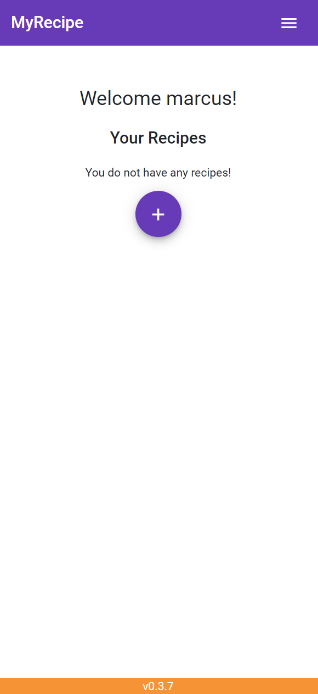
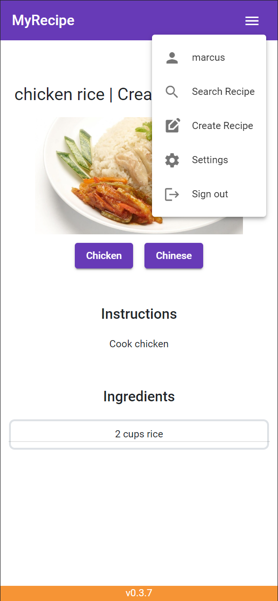
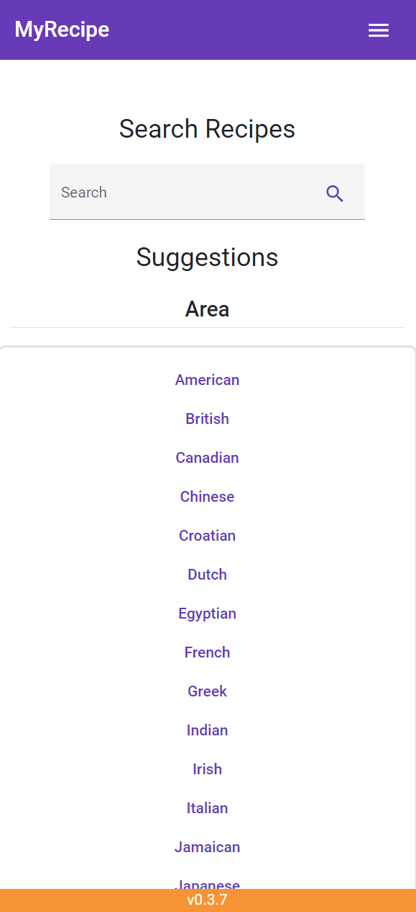
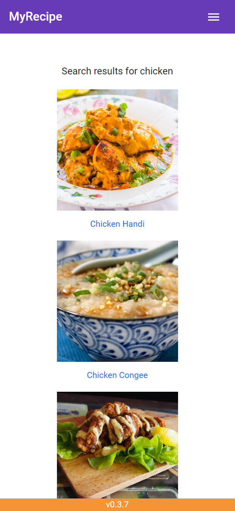
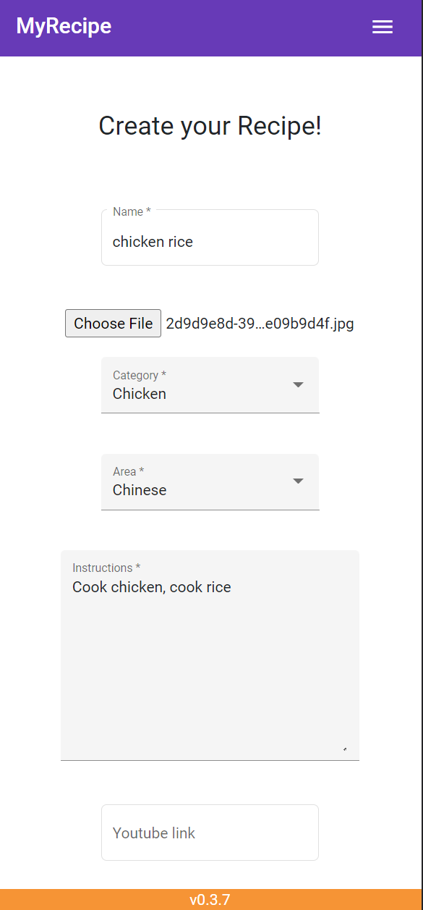
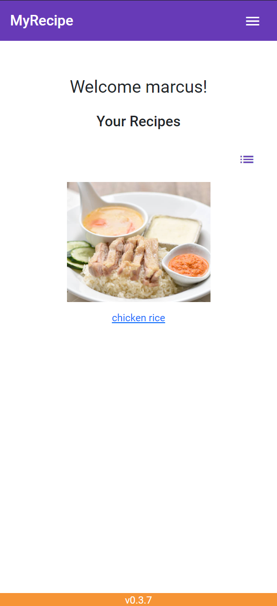
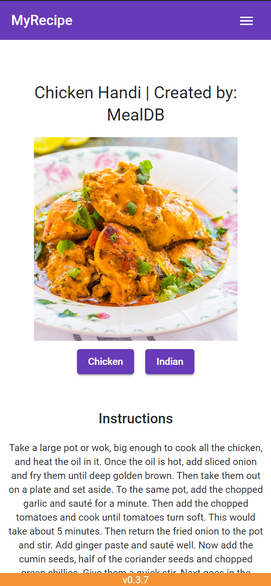

## Project Description
A web application that allows you to search, create and share cooking recipes! This application is a Single Page Application (SPA) and a touch of Progressive Web Application (PWA).

## Stack

## Special Thanks

## Screenshots

## (NOTE: The links below are not working anymore!)
### Heroku URL
https://myrecipevttp.herokuapp.com

### GAE URL
https://coastal-stone-365105.as.r.appspot.com

### Kubernetes URL
http://188.166.205.27/

